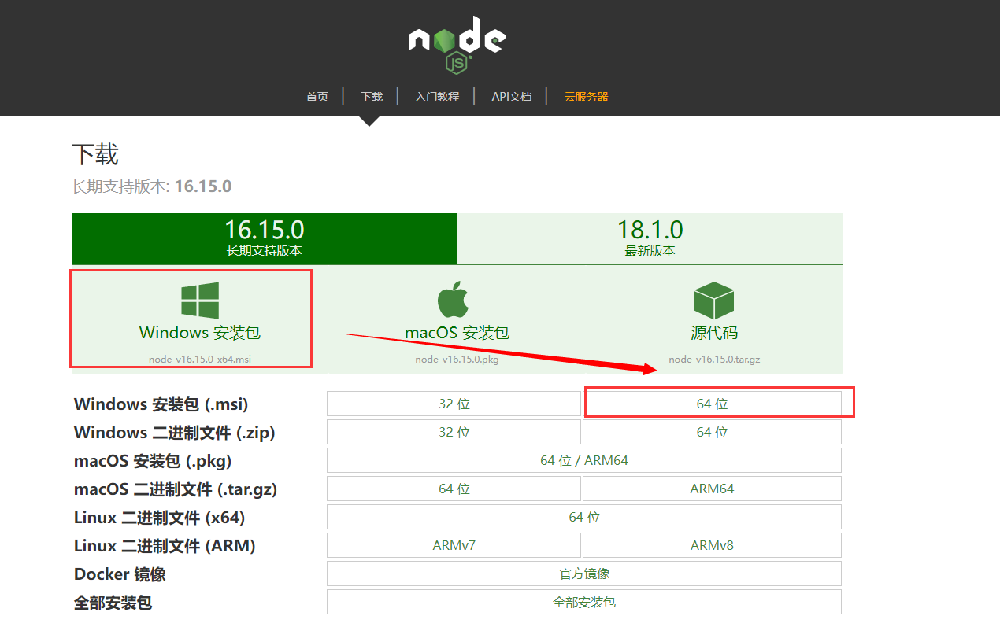
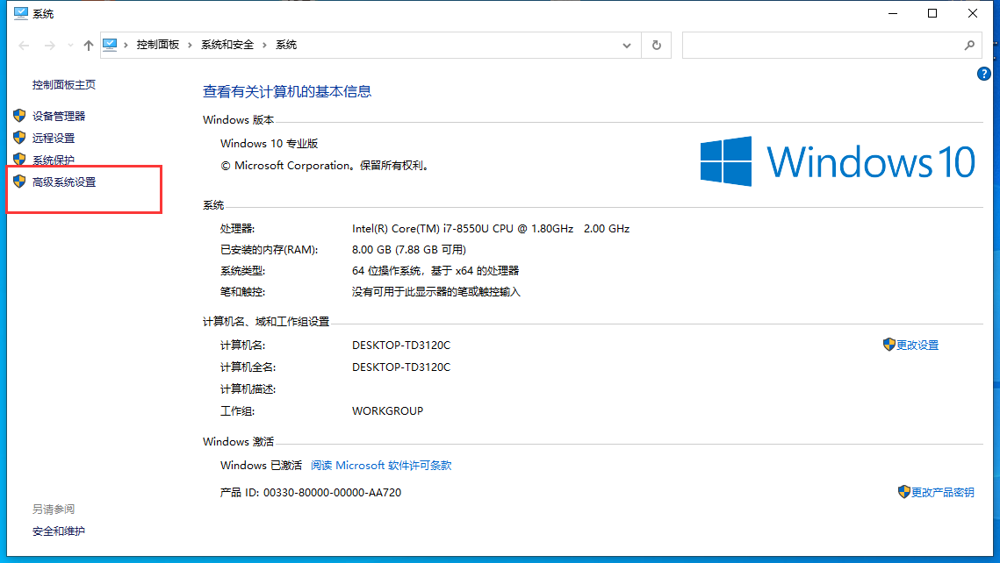
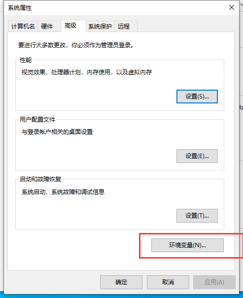
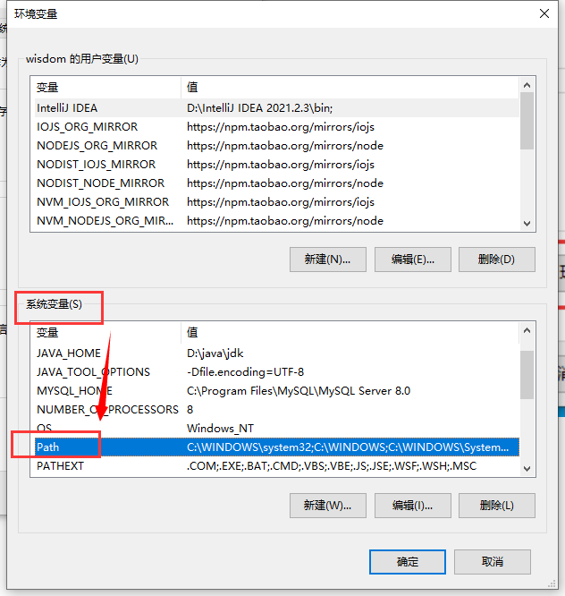
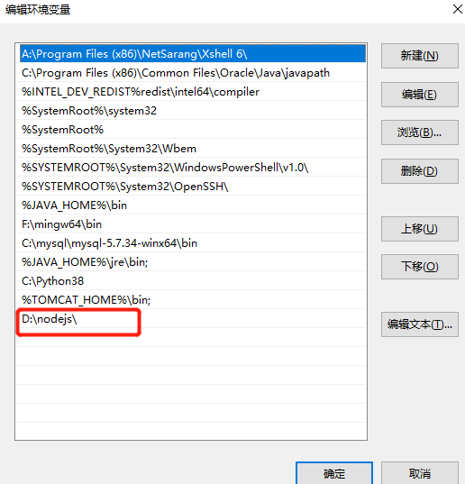
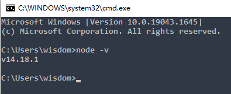
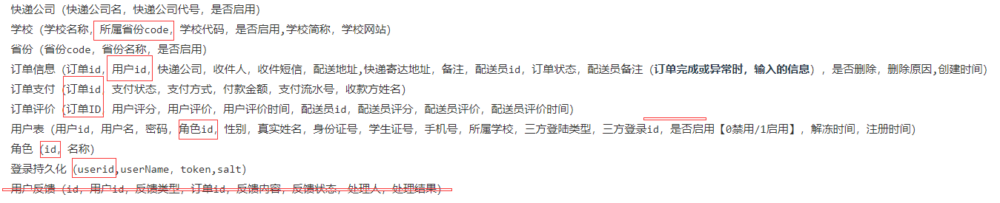

# 快递代取系统

#### 介绍

**前端** vue2 + element-ui + axios
<br>

**后端**  springboot + redis + mysql-Plus + JSON WEB TOKEN


#### 系统运行环境
前后端分开运行：前端：可运行在Node和Nginx上后端：运行在springboot内置的tomcat上，可运行在windows和linux上

#### 安装配置说明
本地Windows运行

##### 前端
安装Node.js 
下载地址：http://nodejs.cn/download/

安装参考地址：https://blog.csdn.net/qq_40712862/article/details/120231621 
安装完成后。
配置环境变量
复制安装地址里面的node.exe的目录 

我的电脑->属性


高级系统设置->环境变量


在系统变量里面找到path


添加一行，复制刚刚复制的目录


运行cmd，测试node环境变量是否配置完成


修改src->request->http.js里面的baseURL: "http://localhost:8090" 进入项目根目录，运行npm install命令安装项目所需要的依赖 安装完成后，运行npm run serve启动项目

##### 后端
安装MySQL数据库 
http://xiaofei.work/#/MySQL/MySql%E5%AE%89%E8%A3%85  
连接数据库，运行sql文件，初始化数据  
修改resources里面的application.yml文件的数据库连接配置  
进入idea编辑器，运行springboot启动类

Linux运行：

前端
安装nginx
http://xiaofei.work/#/linux/%E5%B8%B8%E7%94%A8linux%E5%91%BD%E4%BB%A4?id=%e5%ae%89%e8%a3%85%e5%b9%b6%e6%b5%8b%e8%af%95nginx%e8%b4%9f%e8%bd%bd%e5%9d%87%e8%a1%a1  
本地打包使用npm run build 复制到nginx目录,设置网站根目录
```shell
#运行
./nginx
```

后端
安装java
http://xiaofei.work/#/linux/%E5%B8%B8%E7%94%A8linux%E5%91%BD%E4%BB%A4?id=%e5%ae%89%e8%a3%85java  
本地使用maven打成jar包，上传到服务器
```shell
#运行 
nohup java -jar 包名.jar > 日志路径 1>2& &
```


#### 三层架构应用图


#### 系统架构流程图


#### 系统结构功能图


#### 数据模型 E-R 图


#### E-R图


#### 详细设计（部分不完整）

##### 数据库表结构

~~地址（父级id，名称，简称，等级（1省/直辖市，2地级市，3区县，4镇/街道，状态【0启用/1禁用】）~~
快递公司（快递公司名，快递公司代号，是否启用）

学校（学校名称，所属省份code，学校代码，是否启用,学校简称，学校网站）

省份（省份code，省份名称，是否启用）
订单信息（订单id，用户id，快递公司，收件人，收件短信，配送地址,快递寄达地址，备注，配送员id，订单状态，配送员备注（**订单完成或异常时，输入的信息**），是否删除，删除原因,创建时间）
订单支付（订单id，支付状态，支付方式，付款金额，支付流水号，收款方姓名）

订单评价（订单ID，用户评分，用户评价，用户评价时间，配送员id，配送员评分，配送员评价，配送员评价时间）

用户表（用户id，用户名，密码，角色id，性别，真实姓名，身份证号，学生证号，手机号，所属学校，三方登陆类型，三方登录id，是否启用【0禁用/1启用】，解冻时间，注册时间）

角色（id，名称）

登录持久化（userid,userName，token,salt）

用户反馈（id，用户id，反馈类型，订单id，反馈内容，反馈状态，处理人，处理结果）



##### 订单状态

```js
orderStatus
orderStatus_cnName
```

| 订单状态 | 名称     |
| :------: | -------- |
|    10    | 等待接单 |
|    20    | 派送中   |
|    30    | 订单异常 |
|    40    | 订单完成 |

##### 弹出框的订单状态显示

```
orderStep 
0 等待接单
1 派送中
2 订单异常
3 订单完成
```

##### 评价信息

```
completeEvaluationFlag
```

| 评价状态 |  描述  |
| :------: | :----: |
|    0     | 未评价 |
|    1     | 已评价 |

##### 订单是否删除

```
isDel
```

| 订单状态 |  描述  |
| :------: | :----: |
|    0     | 未删除 |
|    1     |  撤销  |
|    -1    |  删除  |


##### 支付状态

```js
paymentStatus
paymentStatus_cnName
```

| 支付状态 | 描述     |
| -------- | -------- |
| 0        | 等待支付 |
| 1        | 支付成功 |

##### 不同用户的订单查询

普通用户：用户id == 收件人id

配送员：用户id == 配送员id

管理员：-


##### 用户角色

1. 普通用户 'C' 
2. 配送员 'B'
3. 管理员 'A'

##### 代办

- [ ] 动态路由

- [ ] 接口判断用户权限，拦截请求，获取token，叫校验用户角色


###### 未解决

1. 多用户的登录
```
token存储键唯一，在同一个浏览器开两个网页，一个用户登录，另一个用其他账号登陆后，之前登录的token会被覆盖，前一个用户不会自动刷新页面退出，还可以操作，但是用户以及切换，页面还没变。
```

  
